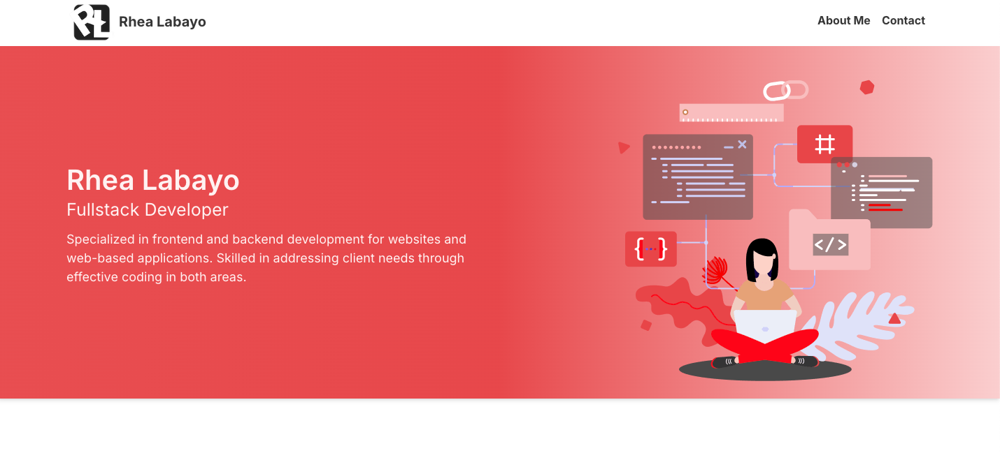

    

    <h1>Rhea Labayo</h1>

I'm a Software Engineer specializing in building websites. I'm a passionate full-stack web developer from the Philippines, and my goal is to deliver functional and visually appealing websites. I am also eager to learn new web development tools to create even more powerful websites.

 
<h2>About the Project</h2>

    You will learn about my skill and experiences in this website. To know more about me you can click the <a href="https://rhealabayo.site/" alt="Portfolio website" style="text-decoration:none;font-weight:bold;color:black;">link</a> to my portfolio. 

    

 
<h2>Built with</h2>

Web development tools:

<ul style="list-style-type:disc;">
    <li style="display:flex; align-items:center;"> &nbsp; Figma </li>
    <li style="display:flex; align-items:center;"> &nbsp; React JS </li>
    <li style="display:flex; align-items:center;">  &nbsp; HTML & CSS </li>
    <li style="display:flex; align-items:center;"> &nbsp; Tailwind CSS </li>
    <li style="display:flex; align-items:center;"> &nbsp; Hostinger </li>
    <li style="display:flex; align-items:center;"> &nbsp; Visual Studio Code </li>
</ul>
 

<!--  -->

💬 Ask me about anything and I'm happy to help. You can contact me to this email address rhea.labayo08@gmail.com.

Thank you very much! I'm excited to talk to you soon.
